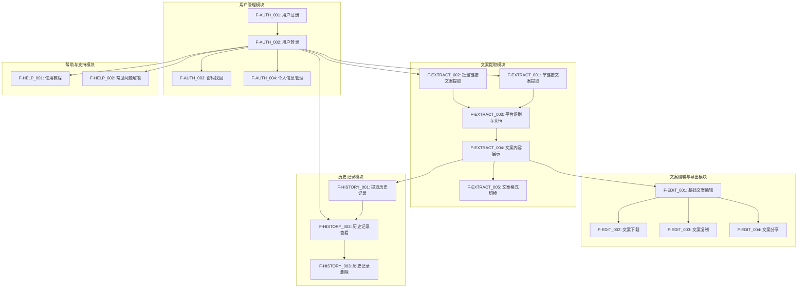
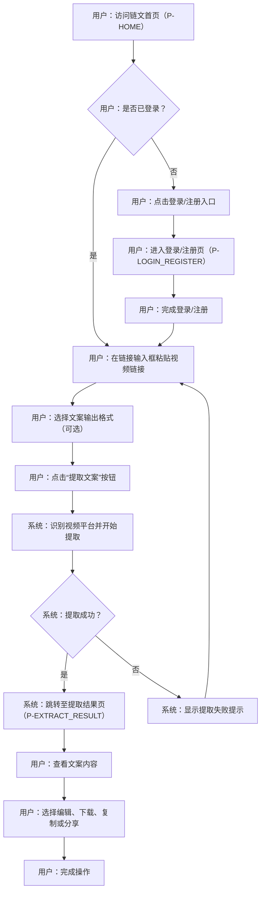
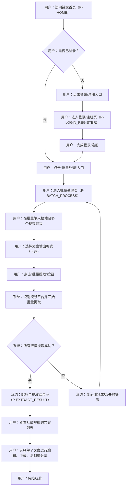
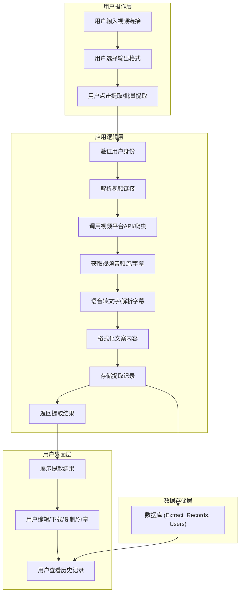

# 链文产品需求文档

## 1. 产品概述

### 1.1 产品名称与定位

*   **产品名称:** 链文
*   **产品定位:** 一款面向内容创作者的Web端工具类应用，旨在通过提供高效、准确的视频文案提取服务，解决手动提取文案耗时的痛点，提升内容创作效率。

### 1.2 产品应用语言

*   **产品应用语言:** 简体中文

### 1.3 产品愿景与目标

*   **产品愿景:** 成为内容创作者获取视频文案的首选工具，赋能用户高效利用视频内容，激发创作灵感。
*   **产品目标:**
    *   提供多平台视频文案提取能力，覆盖主流视频平台。
    *   确保文案提取的准确性和完整性。
    *   提供便捷的文案编辑和下载功能。
    *   支持批量处理，大幅提升用户效率。
    *   提供流畅、直观的Web端用户体验。

### 1.4 产品使用终端

*   **主要终端:** Web端桌面应用
*   **浏览器支持:** Chrome 90+、Firefox 88+、Safari 14+、Edge 90+
*   **分辨率支持:** 768x480及以上分辨率，最佳体验为1920x1080
*   **响应式适配:** 支持768px以上的所有桌面和平板设备。

### 1.5 核心价值主张

*   **高效便捷:** 一键提取视频文案，告别繁琐的手动操作，节省大量时间。
*   **准确完整:** 确保提取的文案内容与视频原声高度一致，保留时间戳等关键信息。
*   **多平台支持:** 覆盖主流视频平台，满足用户多样化的内容获取需求。
*   **灵活输出:** 支持多种文案输出格式，方便用户进行二次编辑和应用。
*   **批量处理:** 支持同时处理多个视频链接，进一步提升工作效率。

### 1.6 目标用户群体分析

*   **用户画像:**
    *   **内容创作者:** 包括自媒体博主、视频UP主、短视频创作者、文案策划等。
    *   **学生/研究人员:** 需要快速获取视频内容进行学习、研究或笔记整理的用户。
    *   **普通用户:** 对视频内容感兴趣，希望快速预览或获取文案的用户。
*   **用户痛点:**
    *   手动逐句听写视频文案耗时耗力，效率低下。
    *   部分视频平台不提供文案下载功能，获取困难。
    *   需要快速获取视频内容摘要或关键信息，用于内容二次加工或学习。
    *   缺乏统一的工具来处理不同平台的视频文案提取需求。
*   **用户需求:**
    *   快速、准确地提取视频文案。
    *   支持主流视频平台。
    *   提供多种文案输出格式。
    *   具备基础的文案编辑功能。
    *   支持批量处理多个视频链接。

### 1.7 市场需求与竞品简析

*   **市场需求:** 随着短视频和长视频内容的爆发式增长，内容创作者对高效获取和利用视频文案的需求日益旺盛。市场缺乏一款功能全面、操作简便、支持多平台且能保证准确性的Web端文案提取工具。
*   **竞品简析:**
    *   **现有工具:** 市场上存在一些视频转文字工具，但多为移动端应用或功能单一的桌面软件，Web端解决方案较少。
    *   **优势:** 链文作为Web端工具，无需安装，即开即用，且专注于视频文案提取，提供多平台支持、批量处理和多种输出格式，形成差异化竞争优势。
    *   **挑战:** 需确保文案提取的准确性和速度，同时提供稳定的服务和良好的用户体验。

### 1.8 浏览器兼容性要求

*   **桌面浏览器:**
    *   Google Chrome (最新2个稳定版本)
    *   Mozilla Firefox (最新2个稳定版本)
    *   Microsoft Edge (最新2个稳定版本)
    *   Apple Safari (最新2个稳定版本)
*   **分辨率支持:** 最小支持1024x768，推荐1920x1080及以上分辨率。
*   **响应式设计:** 确保在不同屏幕尺寸下（特别是桌面和主流平板设备）提供良好的用户体验和布局适配。

## 2. 功能规格

### 2.1 功能详述

#### 2.1.1 用户认证与管理

| 功能ID | 功能名称 | 功能描述 | 优先级 |
|--------|---------|---------|--------|
| F-AUTH_001 | 用户注册 | 用户通过手机号/邮箱注册账号，设置密码。 | P0 |
| F-AUTH_002 | 用户登录 | 用户通过注册的账号进行登录。 | P0 |
| F-AUTH_003 | 密码找回 | 用户通过手机号/邮箱找回或重置密码。 | P1 |
| F-AUTH_004 | 个人信息管理 | 用户可查看和修改个人基本信息（如昵称、头像）。 | P2 |

#### 2.1.2 视频文案提取

| 功能ID | 功能名称 | 功能描述 | 优先级 |
|--------|---------|---------|--------|
| F-EXTRACT_001 | 单链接文案提取 | 用户输入单个视频链接，系统自动识别平台并提取文案。 | P0 |
| F-EXTRACT_002 | 批量链接文案提取 | 用户输入多个视频链接（支持5个以上），系统批量识别并提取文案。 | P0 |
| F-EXTRACT_003 | 平台识别与支持 | 系统自动识别Bilibili、YouTube、抖音等视频平台链接，并进行文案提取。 | P0 |
| F-EXTRACT_004 | 文案内容展示 | 提取成功后，在页面上清晰展示提取到的文案内容。 | P0 |
| F-EXTRACT_005 | 文案格式切换 | 用户可在提取结果页切换文案的显示格式（Markdown、带时间戳文本）。 | P0 |

#### 2.1.3 文案编辑与导出

| 功能ID | 功能名称 | 功能描述 | 优先级 |
|--------|---------|---------|--------|
| F-EDIT_001 | 基础文案编辑 | 用户可对提取到的文案进行基础编辑，如复制、粘贴、删除、查找替换等。 | P0 |
| F-EDIT_002 | 文案下载 | 用户可将编辑后的文案下载到本地，支持Markdown和带时间戳文本格式。 | P0 |
| F-EDIT_003 | 文案复制 | 用户可一键复制提取或编辑后的文案内容。 | P0 |
| F-EDIT_004 | 文案分享 | 用户可生成文案分享链接，方便分享给他人。 | P1 |

#### 2.1.4 历史记录管理

| 功能ID | 功能名称 | 功能描述 | 优先级 |
|--------|---------|---------|--------|
| F-HISTORY_001 | 提取历史记录 | 系统自动保存用户的文案提取历史记录，方便用户查看和管理。 | P0 |
| F-HISTORY_002 | 历史记录查看 | 用户可查看每次提取的视频链接、提取时间、文案内容摘要等信息。 | P0 |
| F-HISTORY_003 | 历史记录删除 | 用户可删除单条或多条历史记录。 | P1 |

#### 2.1.5 帮助与支持

| 功能ID | 功能名称 | 功能描述 | 优先级 |
|--------|---------|---------|--------|
| F-HELP_001 | 使用教程 | 提供详细的使用教程，指导用户如何使用产品各项功能。 | P1 |
| F-HELP_002 | 常见问题解答 | 提供常见问题（FAQ）解答，帮助用户解决常见疑问。 | P1 |

### 2.2 功能模块间的关系图

## 3. 用户流程

### 3.1 用户旅程地图

| 阶段 | 用户行为 | 痛点/需求 | 触点 | 系统响应 | 体验目标 |
|------|----------|-----------|------|----------|----------|
| **发现** | 寻找视频文案提取工具 | 手动提取耗时，效率低 | 搜索引擎、社交媒体 | 展示产品功能和优势 | 吸引用户访问 |
| **注册/登录** | 注册新账号或登录现有账号 | 快速便捷地进入系统 | 登录/注册页（P-LOGIN_REGISTER） | 提供注册/登录入口，验证身份 | 顺利完成身份验证 |
| **提取文案** | 输入视频链接，选择格式 | 快速准确获取文案 | 首页（P-HOME）、批量处理页（P-BATCH_PROCESS） | 识别链接，开始提取，显示进度 | 文案提取成功，内容准确 |
| **查看/编辑** | 查看提取结果，进行修改 | 文案内容需要调整，方便后续使用 | 提取结果页（P-EXTRACT_RESULT）、文案编辑页（P-TEXT_EDITOR） | 展示文案，提供编辑工具 | 文案内容符合预期，编辑流畅 |
| **导出/分享** | 下载文案或分享给他人 | 方便保存和传播文案 | 提取结果页（P-EXTRACT_RESULT）、文案编辑页（P-TEXT_EDITOR） | 提供下载、复制、分享功能 | 文案成功导出或分享 |
| **管理历史** | 查看或删除历史记录 | 方便回顾和管理已提取文案 | 历史记录页（P-HISTORY） | 展示历史列表，提供管理操作 | 历史记录清晰，管理便捷 |
| **寻求帮助** | 遇到问题，查找解决方案 | 快速解决疑问，不影响使用 | 帮助/教程页（P-HELP） | 提供教程和FAQ | 问题得到及时解决 |

### 3.2 关键业务流程图

#### 3.2.1 单链接文案提取流程

#### 3.2.2 批量链接文案提取流程

### 3.3 各场景下的用户操作步骤

#### 3.3.1 场景一：首次使用并提取单条文案

1.  **用户**：打开浏览器，输入链文网址，进入首页（P-HOME）。
2.  **用户**：点击页面上的“登录/注册”入口。
3.  **用户**：进入登录/注册页（P-LOGIN_REGISTER），选择“注册”，填写手机号/邮箱、密码，完成注册。
4.  **用户**：自动跳转回首页（P-HOME），在链接输入框粘贴一个Bilibili视频链接。
5.  **用户**：选择“带时间戳文本”输出格式。
6.  **用户**：点击“提取文案”按钮。
7.  **系统**：显示提取进度条或加载动画。
8.  **系统**：提取成功后，自动跳转至提取结果页（P-EXTRACT_RESULT），展示提取到的带时间戳文案。
9.  **用户**：浏览文案内容，确认无误后，点击“下载”按钮，将文案保存到本地。

#### 3.3.2 场景二：批量提取并编辑文案

1.  **用户**：已登录，在首页（P-HOME）点击左侧导航栏的“批量处理”入口。
2.  **用户**：进入批量处理页（P-BATCH_PROCESS），在文本框中粘贴多个YouTube和抖音视频链接（每行一个）。
3.  **用户**：选择“Markdown格式”输出。
4.  **用户**：点击“批量提取”按钮。
5.  **系统**：显示批量提取进度，完成后跳转至提取结果页（P-EXTRACT_RESULT），以列表形式展示所有提取结果。
6.  **用户**：点击其中一个提取结果的“编辑”按钮。
7.  **系统**：跳转至文案编辑页（P-TEXT_EDITOR），加载该文案内容。
8.  **用户**：对文案进行修改（如删除冗余内容、调整段落顺序）。
9.  **用户**：点击“保存”按钮，系统提示保存成功。
10. **用户**：点击“下载”按钮，将编辑后的Markdown文案保存到本地。

#### 3.3.3 场景三：查看历史提取记录

1.  **用户**：已登录，在首页（P-HOME）点击左侧导航栏的“历史记录”入口。
2.  **用户**：进入历史记录页（P-HISTORY），页面展示所有历史提取记录列表。
3.  **用户**：通过搜索框或筛选条件查找特定的历史记录。
4.  **用户**：点击某条历史记录的“查看”按钮。
5.  **系统**：跳转至提取结果页（P-EXTRACT_RESULT），展示该次提取的文案内容。
6.  **用户**：可选择再次下载、复制或分享该文案。
7.  **用户**：返回历史记录页（P-HISTORY），勾选多条记录，点击“删除”按钮，确认删除。

## 4. 数据流设计

### 4.1 数据结构与关系

*   **用户表 (Users)**
    *   `user_id` (PK, UUID): 用户唯一标识
    *   `username` (String): 用户名/昵称
    *   `email` (String, Unique): 邮箱地址
    *   `phone_number` (String, Unique): 手机号码
    *   `password_hash` (String): 密码哈希值
    *   `created_at` (Timestamp): 注册时间
    *   `updated_at` (Timestamp): 最后更新时间
*   **提取记录表 (Extract_Records)**
    *   `record_id` (PK, UUID): 提取记录唯一标识
    *   `user_id` (FK, UUID): 关联用户ID
    *   `video_url` (String): 原始视频链接
    *   `platform` (String): 视频平台（如Bilibili, YouTube, 抖音）
    *   `extracted_text` (Text): 提取到的原始文案内容
    *   `timestamp_text` (Text): 带时间戳的文案内容
    *   `markdown_text` (Text): Markdown格式的文案内容
    *   `status` (Enum): 提取状态（成功/失败）
    *   `extracted_at` (Timestamp): 提取时间
    *   `file_path` (String, Optional): 下载文件存储路径（如果需要）
*   **批量任务表 (Batch_Tasks)** (可选，用于跟踪批量任务状态)
    *   `task_id` (PK, UUID): 批量任务唯一标识
    *   `user_id` (FK, UUID): 关联用户ID
    *   `total_links` (Integer): 总链接数
    *   `success_count` (Integer): 成功提取数
    *   `failed_count` (Integer): 失败提取数
    *   `status` (Enum): 任务状态（进行中/已完成）
    *   `created_at` (Timestamp): 任务创建时间
    *   `completed_at` (Timestamp): 任务完成时间

### 4.2 关键数据流向图

### 4.3 数据存储与处理原则

1.  **数据安全:**
    *   用户密码采用加盐哈希存储，不可逆。
    *   所有敏感数据传输采用HTTPS加密。
    *   定期进行数据备份，确保数据可恢复性。
    *   严格控制数据访问权限，遵循最小权限原则。
2.  **数据完整性:**
    *   数据库设计遵循范式，确保数据一致性和完整性。
    *   对用户输入进行严格的格式校验和安全过滤，防止注入攻击。
    *   提取记录与用户ID强关联，确保数据归属清晰。
3.  **数据存储:**
    *   提取到的文案内容（原始、带时间戳、Markdown）存储在数据库中，方便历史查询和再次编辑。
    *   对于下载文件，可考虑存储在对象存储服务中，并在数据库中记录文件路径。
4.  **数据处理:**
    *   视频文案提取过程应异步处理，避免阻塞用户界面。
    *   对于批量提取，应采用任务队列机制，提高处理效率和并发能力。
    *   提取失败的任务应记录失败原因，方便用户排查或系统重试。
5.  **数据隐私:**
    *   严格遵守用户数据隐私保护法规，未经用户授权，不得泄露或滥用用户数据。
    *   提取的文案内容仅用于用户个人使用，不进行二次分析或商业利用。

## 5. 页面规格

### 5.1 页面概览

#### 5.1.1 整体布局架构

*   **布局模式:** Web端响应式布局 - 固定顶部导航栏 + 左侧菜单 + 主内容区。
*   **空间分配策略:**
    *   **顶部导航栏:** 高度60px，固定定位，包含Logo、主要导航链接、用户操作区域。
    *   **左侧菜单:** 宽度200-240px（展开）/48-56px（折叠），固定定位，提供主要功能模块导航。
    *   **主内容区:** 核心展示区域，动态宽度，占据剩余空间，最小宽度建议不低于720px。
    *   **右侧面板:** **严格限制使用**，仅在屏幕宽度≥1440px且功能确实必要时使用，宽度280-320px。必须在布局中占据独立空间，绝对不能浮动遮挡主内容区，且需确保主内容区宽度≥720px。
*   **导航体系:** 顶部主导航（用户相关操作）+ 左侧功能菜单（核心功能模块）+ 面包屑导航（多层级页面）。
*   **交互模式:** 页面切换（通过左侧菜单或导航链接）、模态弹窗（确认操作、简单表单）、侧边抽屉（详情查看）、右键菜单（快捷操作）。

#### 5.1.2 页面列表

| 页面ID | 页面名称 | 核心功能 | 布局类型 | 右侧面板 |
|--------|---------|---------|---------|---------|
| P-LOGIN_REGISTER | 登录/注册页 | 用户身份认证 | 单栏居中 | 不使用 |
| P-HOME | 首页 | 单链接文案提取、功能入口 | 二栏布局 | 慎用(仅在≥1440px且必要时) |
| P-EXTRACT_RESULT | 提取结果页 | 文案内容展示、格式切换、下载、复制、分享、编辑入口 | 二栏布局 | 慎用(仅在≥1440px且必要时) |
| P-TEXT_EDITOR | 文案编辑页 | 文案内容编辑、保存、下载、复制 | 二栏布局 | 不使用 |
| P-HISTORY | 历史记录页 | 提取历史列表、查看、删除 | 二栏布局 | 不使用 |
| P-BATCH_PROCESS | 批量处理页 | 批量链接输入、批量提取 | 二栏布局 | 不使用 |
| P-HELP | 帮助/教程页 | 使用教程、常见问题解答 | 二栏布局 | 不使用 |

### 5.2 页面详情

#### 5.2.1 登录/注册页（P-LOGIN_REGISTER）

**布局架构设计：**
- 页面类型：认证页面
- 布局模式：单栏居中布局
- 空间分配：核心内容区域居中显示，背景为产品品牌元素或简洁设计。

**页面布局架构：**
- 顶部导航栏：无（或仅显示Logo）
- 左侧菜单：无
- 主内容区域：
  - 登录/注册表单区域：居中显示，包含输入框（手机号/邮箱、密码）、验证码（注册时）、登录/注册按钮、忘记密码链接、切换登录/注册模式链接。
  - 品牌信息/标语：可选，位于表单上方或下方。

**响应式适配策略：**
- 大屏幕(≥1440px)：表单区域固定宽度（如400px），居中显示。
- 中屏幕(1200-1439px)：表单区域固定宽度，居中显示。
- 小屏幕(768-1199px)：表单区域宽度自适应，左右留白，居中显示。
- 移动端(<768px)：表单区域宽度充满屏幕，上下留白，居中显示。

**组件尺寸规范：**
- 按钮尺寸：登录/注册按钮高度40px，宽度充满表单区域。
- 输入框：高度40px，宽度充满表单区域。
- 间距规范：表单项间距16px，按钮与表单间距24px。

**核心功能：**
用户注册、用户登录、密码找回入口。

#### 5.2.2 首页（P-HOME）

**布局架构设计：**
- 页面类型：核心功能入口页，单链接文案提取页
- 布局模式：二栏布局（顶部导航+左侧菜单+主内容区）
- 空间分配：顶部导航固定，左侧菜单可折叠，主内容区占据剩余空间。

**页面布局架构：**
- 顶部导航栏：Logo、全局搜索框（可选）、消息通知（可选）、用户头像/昵称、个人中心入口、退出登录。 - 建议高度60px，固定定位。
- 左侧菜单：功能导航菜单，包含“首页”、“批量处理”、“历史记录”、“帮助/教程”等。当前选中“首页”，支持折叠。 - 建议宽度200-240px(展开)/48-56px(折叠)。
- 主内容区域：核心展示区域，建议最小宽度720px。
  - 页面头部：欢迎语、面包屑导航（如“首页”）。 - 建议高度48-60px。
  - 功能介绍区：简要介绍产品核心功能和优势，可包含图文或视频。
  - 链接输入区：
    - 视频链接输入框：大尺寸输入框，支持粘贴。
    - 平台选择区：自动识别平台，或提供下拉选择（Bilibili、YouTube、抖音）。
    - 格式选择区：下拉选择输出格式（Markdown、带时间戳文本）。
    - 提取按钮：大尺寸按钮，如“立即提取”。
  - 使用教程入口：链接或卡片，引导用户前往帮助/教程页（P-HELP）。
  - 登录/注册入口：仅在未登录状态下显示，引导用户前往登录/注册页（P-LOGIN_REGISTER）。

**响应式适配策略：**
- 大屏幕(≥1440px)：二栏布局，左侧菜单展开，主内容区充分利用空间。**严格限制使用右侧面板**，仅在功能确实必要时考虑，且需确保主内容区宽度≥720px。
- 中屏幕(1200-1439px)：二栏布局，左侧菜单展开，主内容区充满剩余空间，**严禁使用右侧面板**。
- 小屏幕(768-1199px)：左侧菜单折叠或抽屉式，主内容区充满，输入框和按钮尺寸自适应。
- 移动端(<768px)：单栏布局，左侧菜单抽屉式，输入框和按钮充满屏幕宽度。

**组件尺寸规范：**
- 按钮尺寸：提取按钮高度44px，其他按钮36px。
- 输入框：视频链接输入框高度40px，宽度充满区域。
- 间距规范：区域间距24px，组件间距16px。

**核心功能：**
单链接文案提取、平台选择、格式选择、功能介绍、导航至其他核心功能模块。

#### 5.2.3 提取结果页（P-EXTRACT_RESULT）

**布局架构设计：**
- 页面类型：结果展示页
- 布局模式：二栏布局（顶部导航+左侧菜单+主内容区）
- 空间分配：顶部导航固定，左侧菜单可折叠，主内容区占据剩余空间。

**页面布局架构：**
- 顶部导航栏：同首页（P-HOME）。
- 左侧菜单：同首页（P-HOME），当前选中“首页”或“批量处理”。
- 主内容区域：核心展示区域，建议最小宽度720px。
  - 页面头部：标题“提取结果”、面包屑导航（如“首页 > 提取结果”）、返回首页按钮。 - 建议高度48-60px。
  - 文案展示区：大尺寸文本框或代码块，展示提取到的文案内容。
  - 格式切换区：按钮组或下拉菜单，用于切换文案显示格式（Markdown、带时间戳文本）。
  - 操作按钮区：
    - 下载按钮：下载当前格式的文案。
    - 复制按钮：一键复制文案内容。
    - 编辑按钮：跳转至文案编辑页（P-TEXT_EDITOR）。
    - 分享按钮：弹出分享链接或分享选项。
  - 批量提取结果列表（仅批量提取时显示）：表格形式展示每个链接的提取状态、平台、文案摘要等。

**响应式适配策略：**
- 大屏幕(≥1440px)：二栏布局，左侧菜单展开，主内容区充分利用空间。**严格限制使用右侧面板**，仅在功能确实必要时考虑，且需确保主内容区宽度≥720px。
- 中屏幕(1200-1439px)：二栏布局，左侧菜单展开，主内容区充满剩余空间，**严禁使用右侧面板**。
- 小屏幕(768-1199px)：左侧菜单折叠或抽屉式，文案展示区自适应，操作按钮垂直排列。
- 移动端(<768px)：单栏布局，左侧菜单抽屉式，文案展示区充满屏幕宽度，操作按钮垂直排列。

**组件尺寸规范：**
- 按钮尺寸：下载、复制、编辑、分享按钮高度36px。
- 文案展示区：高度自适应，最小高度300px。
- 间距规范：区域间距24px，组件间距16px。

**核心功能：**
文案内容展示、文案格式切换、文案下载、文案复制、文案分享、文案编辑入口。

#### 5.2.4 文案编辑页（P-TEXT_EDITOR）

**布局架构设计：**
- 页面类型：内容编辑页
- 布局模式：二栏布局（顶部导航+左侧菜单+主内容区）
- 空间分配：顶部导航固定，左侧菜单可折叠，主内容区占据剩余空间。

**页面布局架构：**
- 顶部导航栏：同首页（P-HOME）。
- 左侧菜单：同首页（P-HOME），当前选中“首页”或“历史记录”。
- 主内容区域：核心展示区域，建议最小宽度720px。
  - 页面头部：标题“文案编辑”、面包屑导航（如“提取结果 > 文案编辑”）、返回按钮。 - 建议高度48-60px。
  - 文案编辑区：大尺寸文本编辑器，支持基础编辑功能（复制、粘贴、删除、查找替换、撤销/重做）。
  - 操作按钮区：
    - 保存按钮：保存编辑后的文案。
    - 下载按钮：下载当前编辑的文案。
    - 复制按钮：一键复制文案内容。

**响应式适配策略：**
- 大屏幕(≥1440px)：二栏布局，左侧菜单展开，主内容区充分利用空间。**严格限制使用右侧面板**，仅在功能确实必要时考虑，且需确保主内容区宽度≥720px。
- 中屏幕(1200-1439px)：二栏布局，左侧菜单展开，主内容区充满剩余空间，**严禁使用右侧面板**。
- 小屏幕(768-1199px)：左侧菜单折叠或抽屉式，编辑区自适应，操作按钮垂直排列。
- 移动端(<768px)：单栏布局，左侧菜单抽屉式，编辑区充满屏幕宽度，操作按钮垂直排列。

**组件尺寸规范：**
- 按钮尺寸：保存、下载、复制按钮高度36px。
- 文案编辑区：高度自适应，最小高度400px。
- 间距规范：区域间距24px，组件间距16px。

**核心功能：**
文案内容编辑、文案保存、文案下载、文案复制。

#### 5.2.5 历史记录页（P-HISTORY）

**布局架构设计：**
- 页面类型：列表管理页
- 布局模式：二栏布局（顶部导航+左侧菜单+主内容区）
- 空间分配：顶部导航固定，左侧菜单可折叠，主内容区占据剩余空间。

**页面布局架构：**
- 顶部导航栏：同首页（P-HOME）。
- 左侧菜单：同首页（P-HOME），当前选中“历史记录”。
- 主内容区域：核心展示区域，建议最小宽度720px。
  - 页面头部：标题“提取历史”、面包屑导航（如“首页 > 提取历史”）。 - 建议高度48-60px。
  - 工具栏区域：搜索框（按视频链接或平台搜索）、筛选条件（按时间、状态）、批量删除按钮。 - 建议高度40-48px。
  - 数据展示区域：表格形式展示提取历史记录。
    - 表格列：复选框、视频链接、平台、提取时间、状态、操作（查看、删除）。
  - 分页区域：分页控件，显示总条数、每页条数选择、跳转功能。 - 建议高度40px。

**响应式适配策略：**
- 大屏幕(≥1440px)：二栏布局，左侧菜单展开，主内容区充分利用空间。**严格限制使用右侧面板**，仅在功能确实必要时考虑，且需确保主内容区宽度≥720px。
- 中屏幕(1200-1439px)：二栏布局，左侧菜单展开，主内容区充满剩余空间，**严禁使用右侧面板**。
- 小屏幕(768-1199px)：左侧菜单折叠或抽屉式，表格列可隐藏或滚动，操作按钮垂直排列。
- 移动端(<768px)：单栏布局，左侧菜单抽屉式，表格转换为卡片列表或仅显示关键信息。

**组件尺寸规范：**
- 按钮尺寸：批量删除按钮高度36px。
- 输入框：搜索框高度36px。
- 表格行高：36-40px。
- 间距规范：区域间距24px，组件间距16px。

**核心功能：**
提取历史记录列表展示、搜索、筛选、批量删除、单条记录查看和删除。

**数据结构：**
| 列名 | 数据类型 | 宽度建议 | 是否可排序 | 操作功能 |
|------|---------|----------|----------|---------|
| 复选框 | 布尔值 | 40px | 否 | 多选 |
| 视频链接 | 文本+链接 | 300px | 否 | 点击跳转原视频 |
| 平台 | 文本 | 100px | 是 | 筛选平台 |
| 提取时间 | 时间戳 | 180px | 是 | 时间排序 |
| 状态 | 文本 | 80px | 是 | 筛选状态 |
| 操作 | 操作按钮组 | 120px | 否 | 查看、删除 |

#### 5.2.6 批量处理页（P-BATCH_PROCESS）

**布局架构设计：**
- 页面类型：批量操作页
- 布局模式：二栏布局（顶部导航+左侧菜单+主内容区）
- 空间分配：顶部导航固定，左侧菜单可折叠，主内容区占据剩余空间。

**页面布局架构：**
- 顶部导航栏：同首页（P-HOME）。
- 左侧菜单：同首页（P-HOME），当前选中“批量处理”。
- 主内容区域：核心展示区域，建议最小宽度720px。
  - 页面头部：标题“批量处理”、面包屑导航（如“首页 > 批量处理”）。 - 建议高度48-60px。
  - 批量链接输入区：
    - 文本域：大尺寸多行文本输入框，提示用户每行输入一个视频链接。
    - 格式选择区：下拉选择输出格式（Markdown、带时间戳文本）。
    - 批量提取按钮：大尺寸按钮，如“开始批量提取”。
  - 批量提取进度/结果预览区（可选）：在提取过程中显示进度条或已完成数量，提取完成后可简要预览结果。

**响应式适配策略：**
- 大屏幕(≥1440px)：二栏布局，左侧菜单展开，主内容区充分利用空间。**严格限制使用右侧面板**，仅在功能确实必要时考虑，且需确保主内容区宽度≥720px。
- 中屏幕(1200-1439px)：二栏布局，左侧菜单展开，主内容区充满剩余空间，**严禁使用右侧面板**。
- 小屏幕(768-1199px)：左侧菜单折叠或抽屉式，文本域和按钮尺寸自适应。
- 移动端(<768px)：单栏布局，左侧菜单抽屉式，文本域和按钮充满屏幕宽度。

**组件尺寸规范：**
- 按钮尺寸：批量提取按钮高度44px。
- 文本域：高度自适应，最小高度200px。
- 间距规范：区域间距24px，组件间距16px。

**核心功能：**
批量视频链接输入、批量文案提取、批量提取进度显示。

#### 5.2.7 帮助/教程页（P-HELP）

**布局架构设计：**
- 页面类型：信息展示页
- 布局模式：二栏布局（顶部导航+左侧菜单+主内容区）
- 空间分配：顶部导航固定，左侧菜单可折叠，主内容区占据剩余空间。

**页面布局架构：**
- 顶部导航栏：同首页（P-HOME）。
- 左侧菜单：同首页（P-HOME），当前选中“帮助/教程”。
- 主内容区域：核心展示区域，建议最小宽度720px。
  - 页面头部：标题“帮助与教程”、面包屑导航（如“首页 > 帮助与教程”）。 - 建议高度48-60px。
  - 内容导航区（可选）：左侧小型二级菜单，包含“使用教程”、“常见问题”等。
  - 内容展示区：
    - 使用教程：图文或视频形式，详细介绍产品各项功能的使用步骤。
    - 常见问题解答（FAQ）：问答形式，解答用户常见疑问。

**响应式适配策略：**
- 大屏幕(≥1440px)：二栏布局，左侧菜单展开，主内容区充分利用空间。**严格限制使用右侧面板**，仅在功能确实必要时考虑，且需确保主内容区宽度≥720px。
- 中屏幕(1200-1439px)：二栏布局，左侧菜单展开，主内容区充满剩余空间，**严禁使用右侧面板**。
- 小屏幕(768-1199px)：左侧菜单折叠或抽屉式，内容区自适应，二级菜单可转换为标签页或折叠面板。
- 移动端(<768px)：单栏布局，左侧菜单抽屉式，内容区充满屏幕宽度。

**组件尺寸规范：**
- 间距规范：区域间距24px，内容段落间距16px。

**核心功能：**
提供使用教程、常见问题解答。

